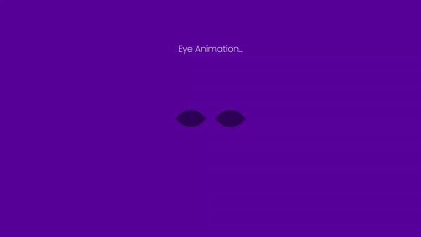

**Título do Projeto: HTML/CSS Eye Animation**

**Descrição:**
Este projeto é uma animação criada em HTML e CSS, desenvolvida com o propósito de praticar habilidades avançadas de CSS e demonstrar conceitos de animação para web. A animação é simples, mas ilustra diversos recursos e técnicas que podem ser explorados e expandidos para criar animações mais complexas.

**Instruções de Uso:**
1. Clone este repositório em sua máquina local.
2. Abra o arquivo `index.html` em seu navegador web preferido.
3. Observe a animação e interaja com ela conforme desejar.
4. Para explorar e experimentar com o código, abra os arquivos HTML e CSS em um editor de código-fonte de sua escolha.

**Recursos Utilizados:**
- HTML5
- CSS3 (incluindo transformações, transições e animações)

**Como Contribuir:**
Se você deseja contribuir para este projeto, você pode seguir os seguintes passos:
1. Faça um fork deste repositório.
2. Clone o fork em sua máquina local.
3. Implemente as alterações ou melhorias desejadas.
4. Teste as alterações localmente para garantir que tudo funcione conforme esperado.
5. Faça um commit das alterações e envie um pull request para análise.

**Aviso Legal:**
Este projeto é fornecido "como está", sem garantias expressas ou implícitas de qualquer tipo. O autor não assume responsabilidade por quaisquer danos resultantes do uso deste software.

**Autor:**
[Acm]
[arthurcesarmarcelino@gmail.com]

**Agradecimentos:**
- Agradeço à faculdade Fatec Franca, por fornecer esta atividade prática para praticarmos nossas habilidades em HTML e CSS.
- Agradeço a todos os colaboradores que contribuíram para este projeto com sugestões, correções e melhorias.

**Exemplo da Animação:**

Link CodePen = https://codepen.io/acmkk/pen/KKLVJBb
